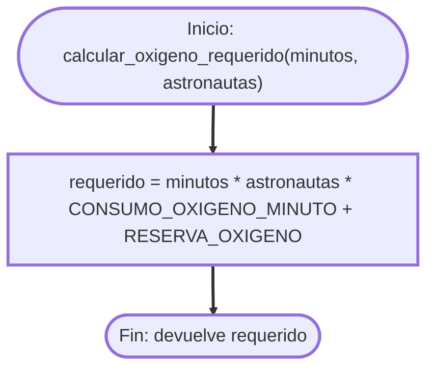

```mermaid
%%{init: {"themeVariables": {"fontFamily": "Arial", "fontSize": "18px"}, "flowchart": {"htmlLabels": true, "wrappingWidth": 350, "padding": 15}}}%%
flowchart TD
    A(["Inicio: calcular_oxigeno_requerido(minutos, astronautas)"]) --> B["requerido = minutos * astronautas * CONSUMO_OXIGENO_MINUTO + RESERVA_OXIGENO"]
    B --> C(["Fin: devuelve requerido"])

    linkStyle default stroke-width:3px
    classDef default stroke-width:3px
```    