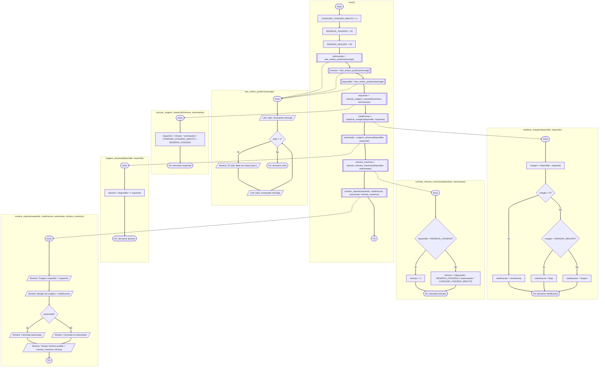

```mermaid
%%{init: {"themeVariables": {"fontFamily": "Arial", "fontSize": "18px"}, "flowchart": {"htmlLabels": true, "wrappingWidth": 350, "padding": 15}}}%%
flowchart TD
    subgraph MAIN["main()"]
        M1([Inicio]) --> M2["CONSUMO_OXIGENO_MINUTO = 2"]
        M2 --> M3["RESERVA_OXIGENO = 20"]
        M3 --> M4["MARGEN_SEGURO = 30"]
        M4 --> M5[["astronautas = leer_entero_positivo(mensaje)"]]
        M5 --> M6[["minutos = leer_entero_positivo(mensaje)"]]
        M6 --> M7[["disponible = leer_entero_positivo(mensaje)"]]
        M7 --> M8[["requerido = calcular_oxigeno_requerido(minutos, astronautas)"]]
        M8 --> M9[["clasificacion = clasificar_margen(disponible, requerido)"]]
        M9 --> M10[["autorizada = oxigeno_alcanza(disponible, requerido)"]]
        M10 --> M11[["minutos_maximos = calcular_minutos_maximos(disponible, astronautas)"]]
        M11 --> M12[["mostrar_reporte(requerido, clasificacion, autorizada, minutos_maximos)"]]
        M12 --> M13([Fin])
    end

    subgraph F1["leer_entero_positivo(mensaje)"]
        L1([Inicio]) --> L2[/"Leer valor, mostrando mensaje"/]
        L2 --> L3{"valor < 1?"}
        L3 -->|Sí| L4[/"Mostrar: El valor debe ser mayor que 0."/]
        L4 --> L5[/"Leer valor, mostrando mensaje"/]
        L5 --> L3
        L3 -->|No| L6(["Fin: devuelve valor"])
    end

    subgraph F2["calcular_oxigeno_requerido(minutos, astronautas)"]
        R1([Inicio]) --> R2["requerido = minutos * astronautas * CONSUMO_OXIGENO_MINUTO + RESERVA_OXIGENO"]
        R2 --> R3(["Fin: devuelve requerido"])
    end

    subgraph F3["clasificar_margen(disponible, requerido)"]
        C1([Inicio]) --> C2["margen = disponible - requerido"]
        C2 --> C3{"margen < 0?"}
        C3 -->|Sí| C4["clasificacion = Insuficiente"]
        C3 -->|No| C5{"margen < MARGEN_SEGURO?"}
        C5 -->|Sí| C6["clasificacion = Bajo"]
        C5 -->|No| C7["clasificacion = Seguro"]
        C4 --> C8(["Fin: devuelve clasificacion"])
        C6 --> C8
        C7 --> C8
    end

    subgraph F4["oxigeno_alcanza(disponible, requerido)"]
        A1([Inicio]) --> A2["alcanza = disponible >= requerido"]
        A2 --> A3(["Fin: devuelve alcanza"])
    end

    subgraph F5["calcular_minutos_maximos(disponible, astronautas)"]
        X1([Inicio]) --> X2{"disponible < RESERVA_OXIGENO?"}
        X2 -->|Sí| X3["minutos = 0"]
        X2 -->|No| X4["minutos = (disponible - RESERVA_OXIGENO) // (astronautas * CONSUMO_OXIGENO_MINUTO)"]
        X3 --> X5(["Fin: devuelve minutos"])
        X4 --> X5
    end

    subgraph F6["mostrar_reporte(requerido, clasificacion, autorizada, minutos_maximos)"]
        P1([Inicio]) --> P2[/"Mostrar: Oxígeno requerido = requerido"/]
        P2 --> P3[/"Mostrar: Margen de oxígeno = clasificacion"/]
        P3 --> P4{"autorizada?"}
        P4 -->|Sí| P5[/"Mostrar: Caminata autorizada."/]
        P4 -->|No| P6[/"Mostrar: Caminata no autorizada."/]
        P5 --> P7[/"Mostrar: Tiempo máximo posible = minutos_maximos minutos"/]
        P6 --> P7
        P7 --> P8([Fin])
    end

    M5 -.-> L1
    M6 -.-> L1
    M7 -.-> L1
    M8 -.-> R1
    M9 -.-> C1
    M10 -.-> A1
    M11 -.-> X1
    M12 -.-> P1
    linkStyle default stroke-width:3px
    classDef default stroke-width:3px
```