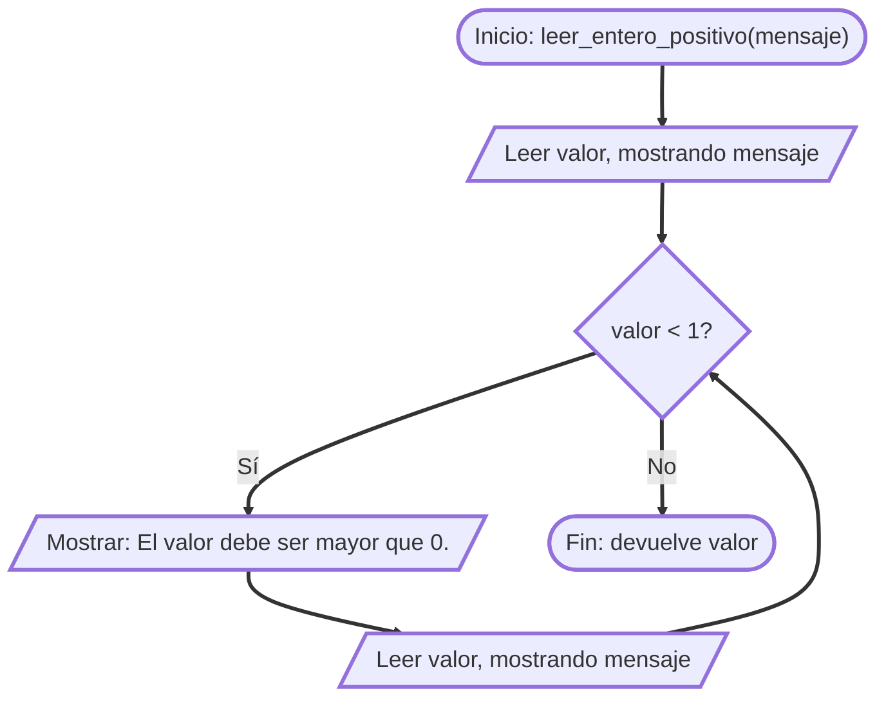

```mermaid
%%{init: {"themeVariables": {"fontFamily": "Arial", "fontSize": "18px"}, "flowchart": {"htmlLabels": true, "wrappingWidth": 350, "padding": 15}}}%%
flowchart TD
    A(["Inicio: leer_entero_positivo(mensaje)"]) --> B[/"Leer valor, mostrando mensaje"/]
    B --> C{"valor < 1?"}
    C -->|Sí| D[/"Mostrar: El valor debe ser mayor que 0."/]
    D --> E[/"Leer valor, mostrando mensaje"/]
    E --> C
    C -->|No| F(["Fin: devuelve valor"])

    linkStyle default stroke-width:3px
    classDef default stroke-width:3px
```