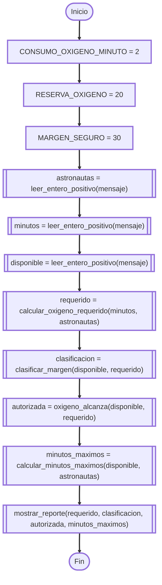

```mermaid
%%{init: {"themeVariables": {"fontFamily": "Arial", "fontSize": "18px"}, "flowchart": {"htmlLabels": true, "wrappingWidth": 350, "padding": 15}}}%%
flowchart TD
    A([Inicio]) --> B["CONSUMO_OXIGENO_MINUTO = 2"]
    B --> C["RESERVA_OXIGENO = 20"]
    C --> D["MARGEN_SEGURO = 30"]
    D --> E[["astronautas = leer_entero_positivo(mensaje)"]]
    E --> F[["minutos = leer_entero_positivo(mensaje)"]]
    F --> G[["disponible = leer_entero_positivo(mensaje)"]]
    G --> H[["requerido = calcular_oxigeno_requerido(minutos, astronautas)"]]
    H --> I[["clasificacion = clasificar_margen(disponible, requerido)"]]
    I --> J[["autorizada = oxigeno_alcanza(disponible, requerido)"]]
    J --> K[["minutos_maximos = calcular_minutos_maximos(disponible, astronautas)"]]
    K --> L[["mostrar_reporte(requerido, clasificacion, autorizada, minutos_maximos)"]]
    L --> M([Fin])

    linkStyle default stroke-width:3px
    classDef default stroke-width:3px
```