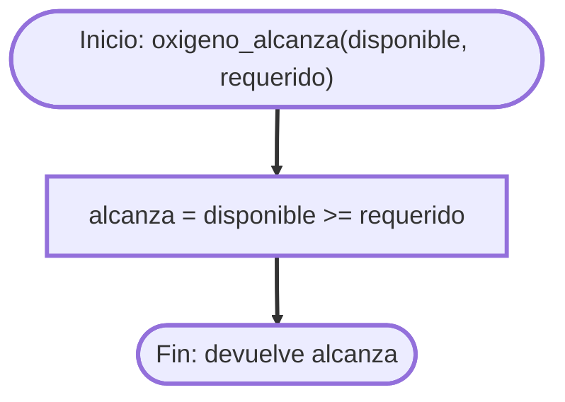

```mermaid
%%{init: {"themeVariables": {"fontFamily": "Arial", "fontSize": "18px"}, "flowchart": {"htmlLabels": true, "wrappingWidth": 350, "padding": 15}}}%%
flowchart TD
    A(["Inicio: oxigeno_alcanza(disponible, requerido)"]) --> B["alcanza = disponible >= requerido"]
    B --> C(["Fin: devuelve alcanza"])

    linkStyle default stroke-width:3px
    classDef default stroke-width:3px
```    