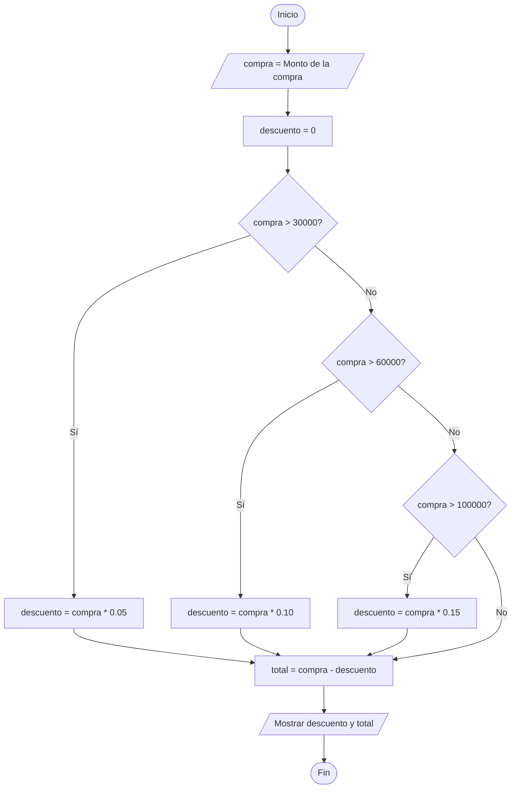

```mermaid
flowchart TD
    A([Inicio]) --> B[/"compra = Monto de la compra"/]
    B --> C["descuento = 0"]
    C --> D{"compra > 30000?"}
    D -->|Sí| E["descuento = compra * 0.05"]
    D -->|No| F{"compra > 60000?"}
    F -->|Sí| G["descuento = compra * 0.10"]
    F -->|No| H{"compra > 100000?"}
    H -->|Sí| I["descuento = compra * 0.15"]
    H -->|No| J["total = compra - descuento"]
    E --> J
    G --> J
    I --> J
    J --> K[/"Mostrar descuento y total"/]
    K --> L([Fin])
```

