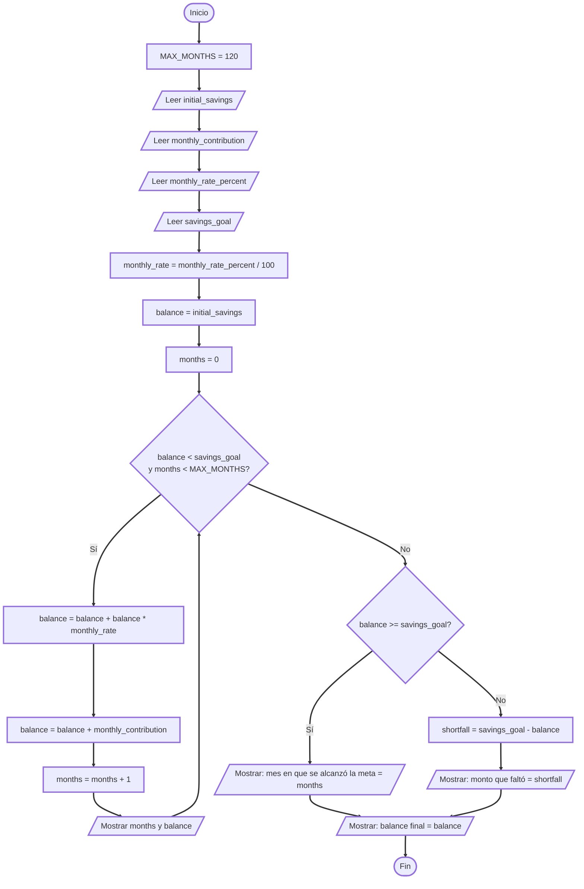

```mermaid
%%{init: {"themeVariables": {"fontFamily": "Arial", "fontSize": "18px"}, "flowchart": {"htmlLabels": true, "wrappingWidth": 350, "padding": 15}}}%%
flowchart TD
    A([Inicio]) --> B["MAX_MONTHS = 120"]
    B --> C[/"Leer initial_savings"/]
    C --> D[/"Leer monthly_contribution"/]
    D --> E[/"Leer monthly_rate_percent"/]
    E --> F[/"Leer savings_goal"/]
    F --> G["monthly_rate = monthly_rate_percent / 100"]
    G --> H["balance = initial_savings"]
    H --> I["months = 0"]
    I --> J{"balance < savings_goal<br/>y months < MAX_MONTHS?"}

    J -->|Sí| K["balance = balance + balance * monthly_rate"]
    J -->|No| O{"balance >= savings_goal?"}

    K --> L["balance = balance + monthly_contribution"]
    L --> M["months = months + 1"]
    M --> N[/"Mostrar months y balance"/]
    N --> J

    O -->|Sí| P[/"Mostrar: mes en que se alcanzó la meta = months"/]
    O -->|No| Q["shortfall = savings_goal - balance"]

    Q --> R[/"Mostrar: monto que faltó = shortfall"/]
    P --> S[/"Mostrar: balance final = balance"/]
    R --> S
    S --> T([Fin])

    linkStyle default stroke-width:3px
    classDef default stroke-width:3px
```