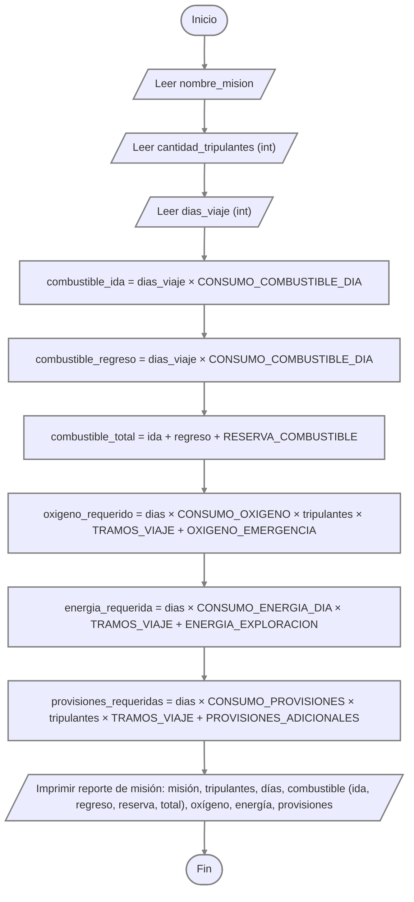

```mermaid
%%{init: {"flowchart": {"wrappingWidth": 500, "padding": 20}}}%%
flowchart TD
    A(["Inicio"]) --> B[/"Leer nombre_mision"/]
    B --> C[/"Leer cantidad_tripulantes (int)"/]
    C --> D[/"Leer dias_viaje (int)"/]
    D --> E["combustible_ida = dias_viaje × CONSUMO_COMBUSTIBLE_DIA"]
    E --> F["combustible_regreso = dias_viaje × CONSUMO_COMBUSTIBLE_DIA"]
    F --> G["combustible_total = ida + regreso + RESERVA_COMBUSTIBLE"]
    G --> H["oxigeno_requerido = dias × CONSUMO_OXIGENO × tripulantes × TRAMOS_VIAJE + OXIGENO_EMERGENCIA"]
    H --> I["energia_requerida = dias × CONSUMO_ENERGIA_DIA × TRAMOS_VIAJE + ENERGIA_EXPLORACION"]
    I --> J["provisiones_requeridas = dias × CONSUMO_PROVISIONES × tripulantes × TRAMOS_VIAJE + PROVISIONES_ADICIONALES"]
    J --> K[/"Imprimir reporte de misión: misión, tripulantes, días, combustible (ida, regreso, reserva, total), oxígeno, energía, provisiones"/]
    K --> L(["Fin"])

    linkStyle default stroke:#808080,stroke-width:2px
    classDef default stroke:#808080,stroke-width:2px
```