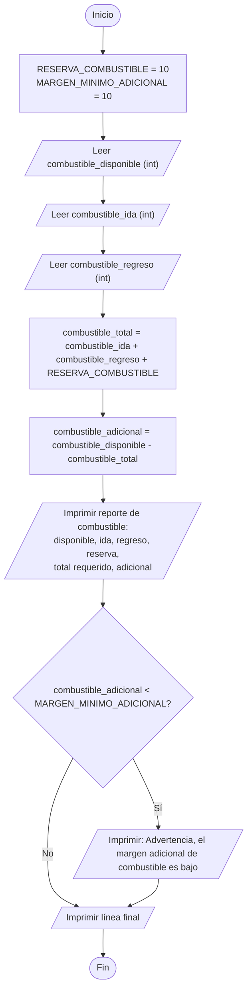

```mermaid
flowchart TD
    A(["Inicio"]) --> B["RESERVA_COMBUSTIBLE = 10<br/>MARGEN_MINIMO_ADICIONAL = 10"]
    B --> C[/"Leer combustible_disponible (int)"/]
    C --> D[/"Leer combustible_ida (int)"/]
    D --> E[/"Leer combustible_regreso (int)"/]
    E --> F["combustible_total = combustible_ida + combustible_regreso + RESERVA_COMBUSTIBLE"]
    F --> G["combustible_adicional = combustible_disponible - combustible_total"]
    G --> H[/"Imprimir reporte de combustible:<br/>disponible, ida, regreso, reserva,<br/>total requerido, adicional"/]
    H --> I{"combustible_adicional < MARGEN_MINIMO_ADICIONAL?"}
    I -- "Sí" --> J[/"Imprimir: Advertencia, el margen adicional de combustible es bajo"/]
    I -- "No" --> K[/"Imprimir línea final"/]
    J --> K
    K --> L(["Fin"])
```