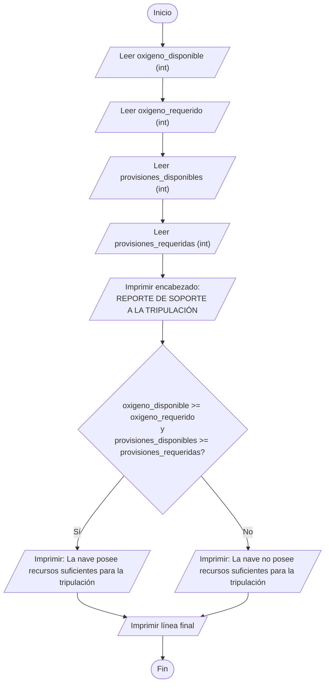

```mermaid
flowchart TD
    A(["Inicio"]) --> B[/"Leer oxigeno_disponible (int)"/]
    B --> C[/"Leer oxigeno_requerido (int)"/]
    C --> D[/"Leer provisiones_disponibles (int)"/]
    D --> E[/"Leer provisiones_requeridas (int)"/]
    E --> F[/"Imprimir encabezado:<br/>REPORTE DE SOPORTE A LA TRIPULACIÓN"/]
    F --> G{"oxigeno_disponible >= oxigeno_requerido<br/>y<br/>provisiones_disponibles >= provisiones_requeridas?"}
    G -- "Sí" --> H[/"Imprimir: La nave posee recursos suficientes para la tripulación"/]
    G -- "No" --> I[/"Imprimir: La nave no posee recursos suficientes para la tripulación"/]
    H --> J[/"Imprimir línea final"/]
    I --> J
    J --> K(["Fin"])
```