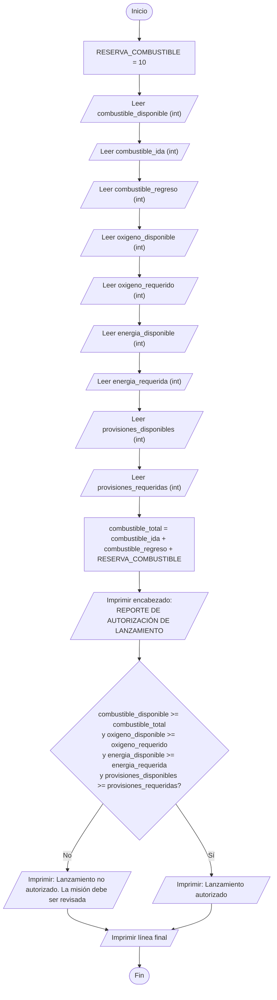

```mermaid
flowchart TD
    A(["Inicio"]) --> B["RESERVA_COMBUSTIBLE = 10"]
    B --> C[/"Leer combustible_disponible (int)"/]
    C --> D[/"Leer combustible_ida (int)"/]
    D --> E[/"Leer combustible_regreso (int)"/]
    E --> F[/"Leer oxigeno_disponible (int)"/]
    F --> G[/"Leer oxigeno_requerido (int)"/]
    G --> H[/"Leer energia_disponible (int)"/]
    H --> I[/"Leer energia_requerida (int)"/]
    I --> J[/"Leer provisiones_disponibles (int)"/]
    J --> K[/"Leer provisiones_requeridas (int)"/]
    K --> L["combustible_total = combustible_ida + combustible_regreso + RESERVA_COMBUSTIBLE"]
    L --> M[/"Imprimir encabezado:<br/>REPORTE DE AUTORIZACIÓN DE LANZAMIENTO"/]
    M --> N{"combustible_disponible >= combustible_total<br/>y oxigeno_disponible >= oxigeno_requerido<br/>y energia_disponible >= energia_requerida<br/>y provisiones_disponibles >= provisiones_requeridas?"}
    N -- "No" --> P[/"Imprimir: Lanzamiento no autorizado. La misión debe ser revisada"/]
    N -- "Sí" --> O[/"Imprimir: Lanzamiento autorizado"/]
    P --> Q[/"Imprimir línea final"/]
    O --> Q
    Q --> R(["Fin"])
```