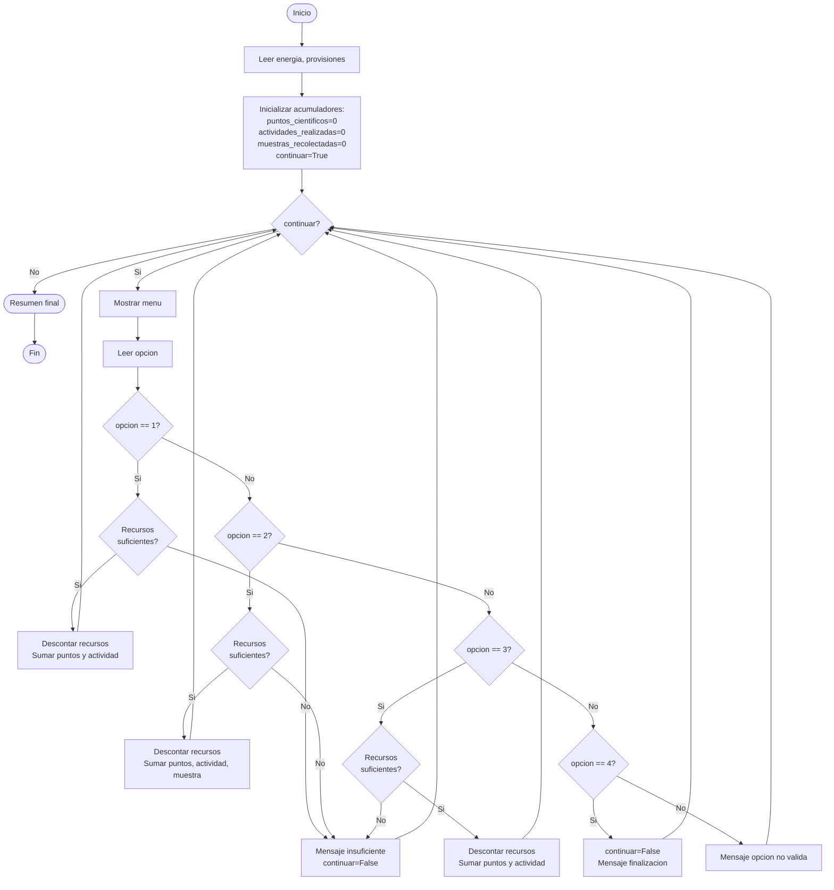

```mermaid
flowchart TD
    A([Inicio]) --> B[Leer energia, provisiones]
    B --> C[Inicializar acumuladores:<br/>puntos_cientificos=0<br/>actividades_realizadas=0<br/>muestras_recolectadas=0<br/>continuar=True]
    C --> D{continuar?}
    D -- No --> Z([Resumen final]) --> FIN([Fin])
    D -- Si --> E[Mostrar menu]
    E --> F[Leer opcion]
    F --> G{opcion == 1?}
    G -- Si --> G1{Recursos<br/>suficientes?}
    G1 -- Si --> G2[Descontar recursos<br/>Sumar puntos y actividad] --> D
    G1 -- No --> X[Mensaje insuficiente<br/>continuar=False] --> D
    G -- No --> H{opcion == 2?}
    H -- Si --> H1{Recursos<br/>suficientes?}
    H1 -- Si --> H2[Descontar recursos<br/>Sumar puntos, actividad, muestra] --> D
    H1 -- No --> X
    H -- No --> I{opcion == 3?}
    I -- Si --> I1{Recursos<br/>suficientes?}
    I1 -- Si --> I2[Descontar recursos<br/>Sumar puntos y actividad] --> D
    I1 -- No --> X
    I -- No --> J{opcion == 4?}
    J -- Si --> J1[continuar=False<br/>Mensaje finalizacion] --> D
    J -- No --> K[Mensaje opcion no valida] --> D
```