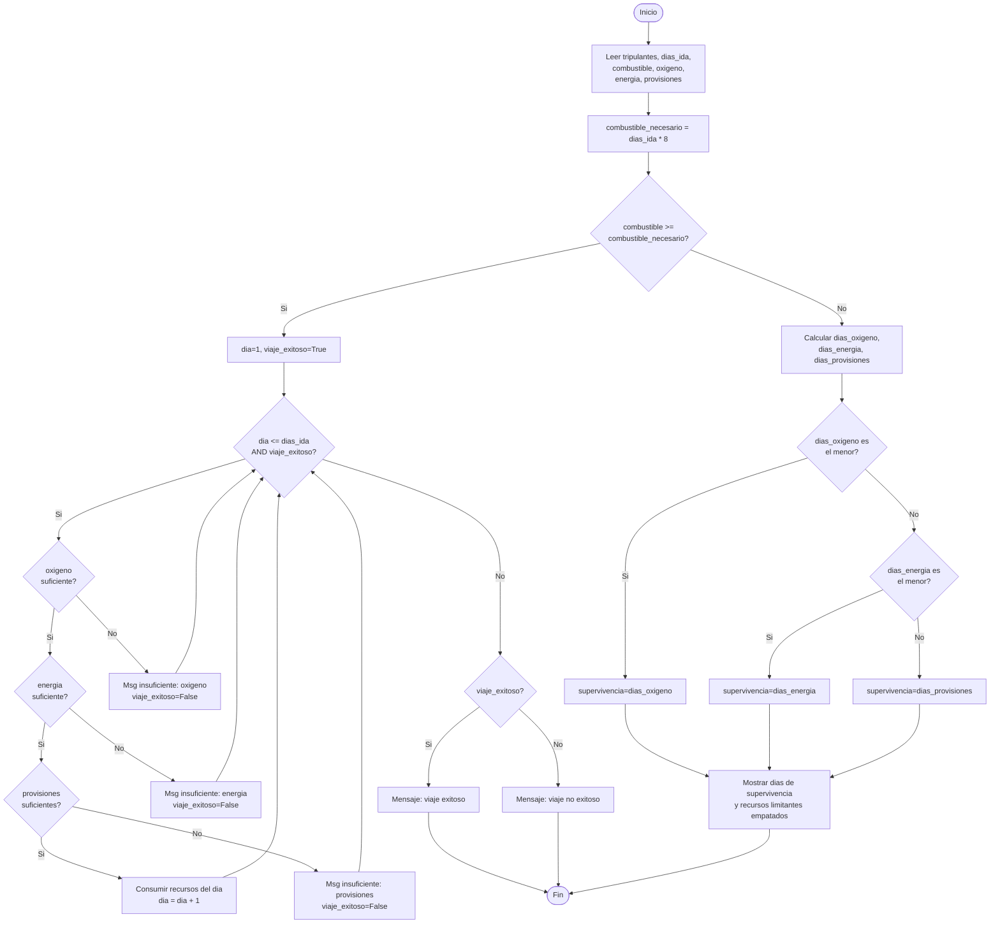

```mermaid
flowchart TD
    A([Inicio]) --> B[Leer tripulantes, dias_ida,<br/>combustible, oxigeno,<br/>energia, provisiones]
    B --> C[combustible_necesario = dias_ida * 8]
    C --> D{combustible >=<br/>combustible_necesario?}
    D -- Si --> E[dia=1, viaje_exitoso=True]
    E --> F{dia <= dias_ida<br/>AND viaje_exitoso?}
    F -- Si --> G{oxigeno<br/>suficiente?}
    G -- Si --> H{energia<br/>suficiente?}
    H -- Si --> I{provisiones<br/>suficientes?}
    I -- Si --> J[Consumir recursos del dia<br/>dia = dia + 1] --> F
    I -- No --> K3[Msg insuficiente: provisiones<br/>viaje_exitoso=False] --> F
    H -- No --> K2[Msg insuficiente: energia<br/>viaje_exitoso=False] --> F
    G -- No --> K1[Msg insuficiente: oxigeno<br/>viaje_exitoso=False] --> F
    F -- No --> L{viaje_exitoso?}
    L -- Si --> M[Mensaje: viaje exitoso] --> FIN([Fin])
    L -- No --> N[Mensaje: viaje no exitoso] --> FIN
    D -- No --> O[Calcular dias_oxigeno,<br/>dias_energia, dias_provisiones]
    O --> P{dias_oxigeno es<br/>el menor?}
    P -- Si --> Q[supervivencia=dias_oxigeno]
    P -- No --> R{dias_energia es<br/>el menor?}
    R -- Si --> S[supervivencia=dias_energia]
    R -- No --> T[supervivencia=dias_provisiones]
    Q --> U[Mostrar dias de supervivencia<br/>y recursos limitantes empatados] --> FIN
    S --> U
    T --> U
```